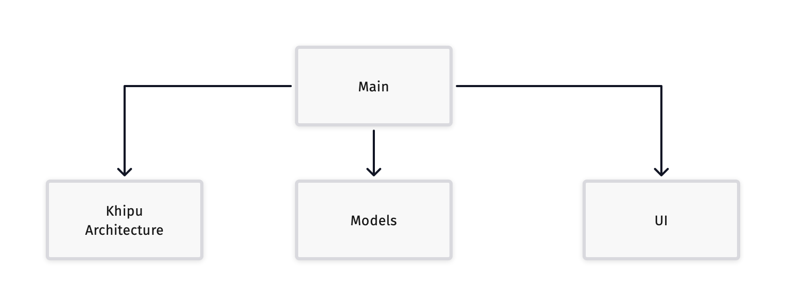

Port of the Redux features described in the amazing article [Wojciech Kulik](https://wojciechkulik.pl/ios/redux-architecture-and-mind-blowing-features).

## Timeline replay

https://user-images.githubusercontent.com/23734068/230716514-50d43443-1dc8-42f4-b27e-c32c7faa72a3.mp4

## Hot reload

https://user-images.githubusercontent.com/23734068/230716506-86ed2d4c-f246-4ca0-a149-a825624c6578.mov

### Modular architecture

### Dependency diagram

(A bit messy but I did my best)

